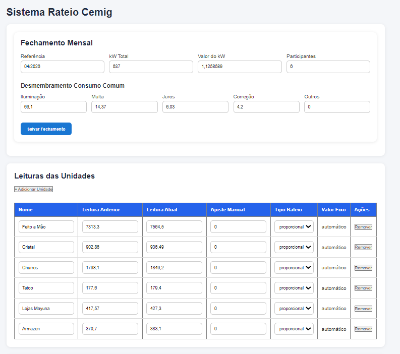
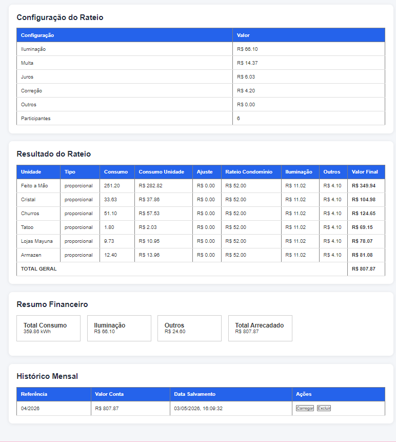
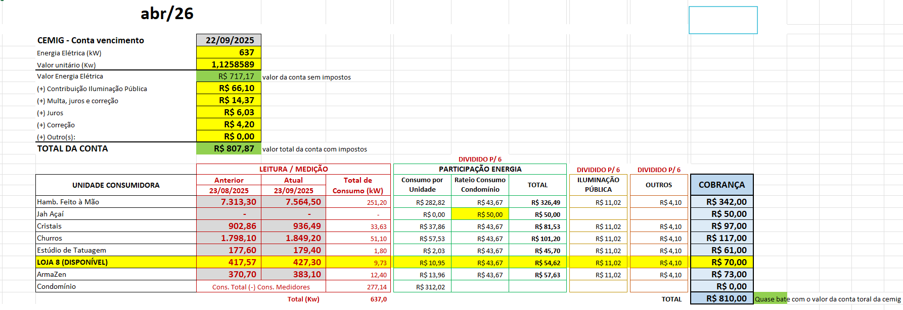

# Sistema Rateio Cemig

## Objetivo do Projeto

O projeto foi desenvolvido para substituir uma planilha manual de rateio de energia elétrica utilizada em um centro comercial.

O sistema calcula automaticamente:

- consumo individual das unidades;
- rateio do consumo comum;
- iluminação pública;
- multas, juros e correções;
- total arrecadado;
- histórico mensal de fechamentos.

O objetivo é que o sistema apresente resultados muito próximos aos valores reais da planilha utilizada atualmente.

---

# Tecnologias Utilizadas

- React
- Vite
- Context API
- LocalStorage
- JavaScript

---

# Estrutura Atual do Projeto

## App.jsx

Arquivo principal responsável pela renderização dos componentes:

- FechamentoMensal
- LeiturasUnidades
- ConfiguracaoRateio
- ResultadoRateio
- CardsResumo
- HistoricoMensal

---

# Contexto Global

## RateioProvider.jsx

Responsável pelo gerenciamento global dos dados do sistema.

### Estados principais:

### fechamento
Armazena:

- referência do mês;
- kW total da conta Cemig;
- valor do kW;
- valor total da conta.

### unidades
Lista das lojas/unidades contendo:

- nome;
- leitura anterior;
- leitura atual;
- tipo de rateio;
- valor fixo;
- ajuste manual.

### consumoComum
Armazena:

- iluminação;
- multa;
- juros;
- correção;
- outros valores;
- quantidade de participantes.

### historicoRateios
Responsável por armazenar os fechamentos salvos mensalmente.

---

# Persistência de Dados

O sistema utiliza LocalStorage para salvar:

- fechamento;
- unidades;
- consumo comum;
- histórico mensal.

Os dados permanecem salvos mesmo após atualizar a página.

---

# Componentes

## FechamentoMensal.jsx

Responsável pelo preenchimento dos dados da conta Cemig.

Permite alterar:

- referência;
- kW total;
- valor do kW;
- participantes;
- iluminação;
- multa;
- juros;
- correção;
- outros.

Os dados atualizam automaticamente o contexto global.

---

## LeiturasUnidades.jsx

Responsável pelo cadastro e edição das unidades.

Funcionalidades:

- adicionar unidade;
- remover unidade;
- editar leituras;
- definir tipo de rateio;
- definir valor fixo;
- ajustes manuais.

Tipos de rateio:

- proporcional;
- fixo;
- isento.

---

## ConfiguracaoRateio.jsx

Exibe os valores de configuração do rateio.

Os valores são alimentados automaticamente pelos dados preenchidos em FechamentoMensal.

---

## ResultadoRateio.jsx

Componente principal do cálculo.

Realiza:

- cálculo do consumo individual;
- cálculo do valor por unidade;
- cálculo do consumo do condomínio;
- rateio do condomínio;
- divisão da iluminação;
- divisão de multas e encargos;
- valor final por unidade.

Também exibe:

- total geral arrecadado.

---

## CardsResumo.jsx

Exibe os indicadores financeiros do sistema:

- total consumo;
- iluminação;
- outros encargos;
- total arrecadado.

---

## HistoricoMensal.jsx

Responsável pelo armazenamento e visualização dos fechamentos mensais.

Cada fechamento salva:

- referência;
- valor total arrecadado;
- data do salvamento;
- dados completos do fechamento;
- unidades;
- consumo comum.

Funcionalidades:

- carregar fechamento salvo;
- excluir histórico.

---

# Regras de Negócio Implementadas

## Consumo Individual

Cálculo:

Leitura Atual - Leitura Anterior

---

## Consumo Unidade

Cálculo:

Consumo × Valor do kW

---

## Consumo Condomínio

Cálculo:

kW Total da Conta - Soma dos Consumos das Unidades

---

## Rateio Condomínio

Cálculo:

(Consumo Condomínio × Valor do kW) / Participantes

---

## Valor Final por Unidade

Composição:

- consumo individual;
- ajuste manual;
- rateio condomínio;
- iluminação;
- outros encargos.

---

# Objetivo das Próximas Evoluções - Se necessário
### A forma que o projeto está estruturado já atende a necessidade do cliente 

Melhorias futuras previstas:

- exportação PDF;
- layout responsivo;
- dashboard gráfico;
- autenticação;
- banco de dados;
- backend;
- cadastro de usuários;
- relatórios mensais;
- impressão de fechamento;
- melhoria visual da interface.

---

# Observações Importantes

O sistema foi desenvolvido inicialmente como protótipo funcional.

Grande parte da lógica foi baseada em uma planilha real já utilizada operacionalmente.

O foco atual está em:

- aproximar os cálculos da planilha original;
- automatizar o fechamento mensal;
- eliminar controles manuais.

---

# Status Atual

Projeto funcional em desenvolvimento.

Principais funcionalidades já operacionais:

- cálculos automáticos;
- persistência local;
- histórico mensal;
- edição dinâmica;
- cálculo de rateio.

## 🖼️ Capturas de Tela

 ### Página 1 - Sistema rateio

 ### Página 2 –  sistema rateio

### Página 3 – Planilha base

 ## 📌 Objetivo
 ##### Protótipo voltado a necessidade do cliente app ImoDan

 ##### Protótipo estruturado por Suellen Dias juntamente com IA.

